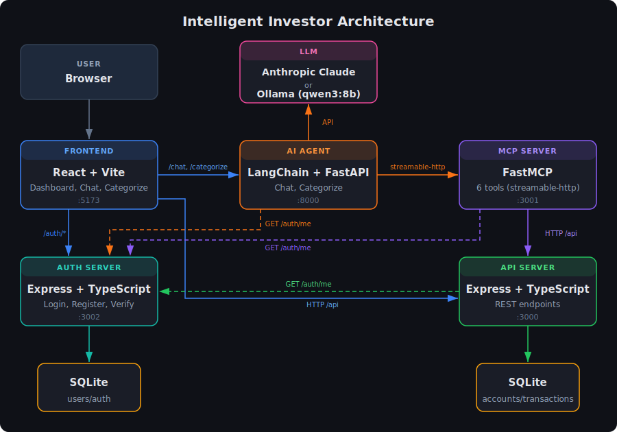

# Intelligent Investor

A full-stack personal finance dashboard with an AI-powered chatbot and auto-categorization, built with React, Express, SQLite, and LangChain.

## Demo

View the demo video [here](https://www.youtube.com/watch?v=LUHECExDa5A)

## Architecture



```
client/        React + Vite + TypeScript frontend (port 5173)
server/        Express + TypeScript API with SQLite (port 3000)
mcp-server/    FastMCP tool server (port 3001)
agent/         Python LangChain agent with FastAPI (port 8000)
```

The AI agent connects to the MCP server to query your financial data, and exposes a FastAPI gateway that the React frontend calls for chat and auto-categorization.

## Prerequisites

- Node.js >= 18
- Python >= 3.11
- [Ollama](https://ollama.com) (only if using a local LLM)

## Install Dependencies

### Node (client, server, mcp-server)

From the project root:

```bash
npm install
```

This installs dependencies for all three npm workspaces (`client`, `server`, `mcp-server`).

### Python (agent)

```bash
cd agent
python -m venv .venv
source .venv/bin/activate
pip install -e .
```

## Configuration

### Option A: Anthropic Cloud LLM (default)

1. Get an API key from [console.anthropic.com](https://console.anthropic.com/)
2. Create `agent/.env` and add your key:

```
ANTHROPIC_API_KEY=sk-ant-...
```

### Option B: Local LLM with Ollama

1. Install Ollama from [ollama.com](https://ollama.com)
2. Pull a model with structured tool-calling support:

```bash
ollama pull qwen3:8b
```

3. Make sure Ollama is running (`ollama serve` or via the desktop app)

No API key is needed for local mode.

## Running the App

You need four terminals (or use a process manager). Start them in this order:

### 1. API Server

```bash
npm run dev:server
```

### 2. MCP Server

```bash
npm run dev:mcp
```

### 3. AI Agent

Using Anthropic cloud LLM (default):

```bash
npm run dev:agent
```

Using local Ollama LLM:

```bash
npm run dev:agent:local
```

### 4. Frontend

```bash
npm run dev:client
```

Then open [http://localhost:5173](http://localhost:5173) in a web browser.

## Features

- **Dashboard** - Summary cards (income/expenses/net), expense breakdown pie chart, cashflow time series with week/month/year toggle
- **Transactions** - Paginated table with all transactions
- **AI Chatbot** - Ask natural language questions about your finances (e.g. "How much did I spend on groceries in December?")
- **Auto-categorize** - AI suggests categories for uncategorized transactions, which you can review and approve
- **Reset Data** - Button in the header to reset the database back to the sample seed data
